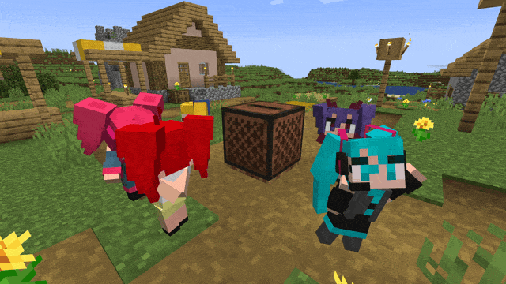
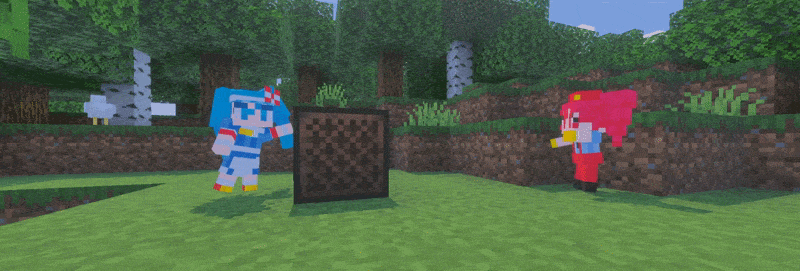
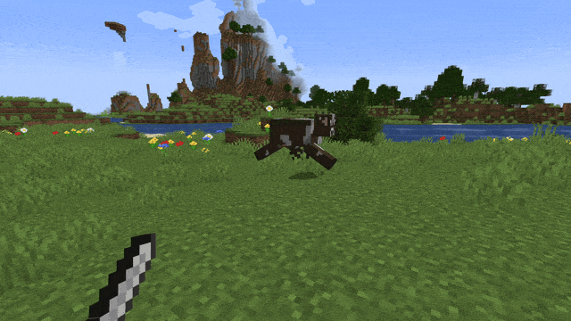
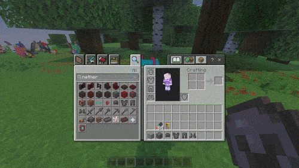
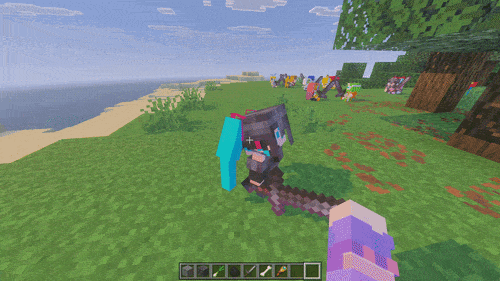
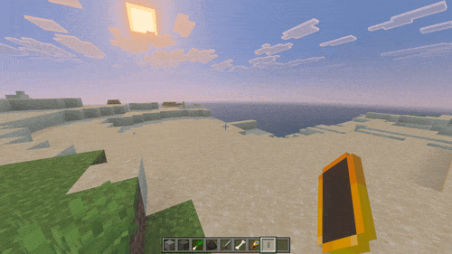

# Miku Plushie // Minecraft Bedrock

<sub> An unofficial Minecraft Bedrock port of the Miku Plushies Java mod by the [4nyNoob](https://github.com/4nyNoob) and [SuoYukii](https://github.com/suoyukii) </sub>

Craft the plushies, wear them as hats, bring them to life as tiny companions, grow leeks for them, and watch them dance!

<p align="center">
  
  
  
  
</p>

<p align="center">
  <a href="https://github.com/YupCore/miku-plushie-mod-bedrock/releases/latest">
    
  </a>
  &nbsp;
  <a href="https://www.curseforge.com/minecraft-bedrock/addons/vocaloids-miku-teto-plushies">
    
  </a>
</p>

<p align="center">
  
</p>

---

## Table of Contents

- [Features](#features)
- [Gameplay](#gameplay)
- [Leeks](#leeks)
- [Crafting](#crafting)
- [Subpacks](#subpacks)
- [Building](#building)
- [FAQ](#faq)
- [Credits](#credits)

---

## Features

- **90+ plush variants** — Miku, Teto, Neru, Rin, Len, Luka, Meiko, Gumi, Kaito, Aiko, Konoha, seasonal variants, crossover variants, and Brazilian Miku variants.
- Every plush can be placed as a block and worn as a hat.
- Plush blocks make character sounds when placed, broken, or used as weapons.
- Use a **Vocaloid Heart** on a placed plush block to summon an already tamed plushie!
- Tamed plushies follow, sit, and fight together with their owner.
- Plushies can equip swords, spears, and all vanilla armor sets — from leather to netherite.
- Use sneak + secondary action on a plush to unequip items one at a time.
- Plushies can be healed with leeks; injured plushies can also eat nearby mature leek crops on their own and heal.
- Leeks generate naturally in taiga biomes, can be farmed, and harvested for leeks and seeds.
- _Most_ Teto variants craft into fully functional **pickaxes** — with durability, enchants, and a break sound.
- Reworked dance animations with smoother transitions! some plushies have expanded dance pools and now slowly cycle randomly through all avaliable dances.
- Jukebox music makes nearby plushies dance. Custom music discs supported via script events.
- Neru's Phone plays her Triple Baka intro with the iconic phone animation.
- Resource subpacks for English dub sounds and legacy textures.
- Translations for English, Brazilian Portuguese, and Simplified Chinese ported & extended from original mod.
- Creative inventory groups for plushies and items.

---

## Gameplay

### Dancing

Plushies dance near playing jukeboxes. Miku, Teto, Neru, and others have multiple dance animations and will cycle between them while music plays! Also, custom music discs play/stop are supported via script events, I'm planning to release an addon soon that takes advantage of this fact, it's still a WIP...

<p align="center">
  
</p>

### Combat & Equipment

Tamed plushies can help in fights. Give them a sword, spear, or armor piece and they will equip it automatically into the correct slot.

<p align="center">
  
</p>

<p align="center">
  
</p>

To remove gear, **sneak and use secondary action** on the plush. Items are dropped one at a time — held weapon first, then armor slots.

<p align="center">
  
</p>

### Hats

Every plush doubles as headwear so you can have a smol Miku or Teto with you at all times!

<p align="center">
  
</p>

### Neru's Phone

Use Neru's Phone to trigger her iconic Triple Baka intro, complete with the clicking sound and phone animation.

<p align="center">
  
</p>

---

## Leeks

Wild leeks generate in **taiga** and **mega taiga** biomes. Break wild crops to collect leeks and seeds, then plant seeds on farmland. PS. drop rates are generous ^\_^

Leek crop properties:

| Property          | Details                                      |
| ----------------- | -------------------------------------------- |
| Growth stages     | 0 -> 7 (8 stages)                            |
| Light requirement | Level 9 or higher                            |
| Grows faster on   | Moisturized farmland                         |
| Bone meal         | Supported                                    |
| Mature drop       | Leeks + seeds                                |
| Passive behavior  | Injured nearby plushies may eat mature crops |

> **Tip:** Holding a leek tempts plushies, can tame them, and heals tamed plushies for **4 HP**.

---

## Crafting

The in-game recipe book contains the full list. The recipes below cover everything you need to get started.

### Basic Plush Blocks

Most base plushies use colored wool in a **3×2** crafting table shape.

> **Miku Plush**
>
> |                      |                       |                      |
> | :------------------: | :-------------------: | :------------------: |
> | <kbd>Cyan Wool</kbd> | <kbd>White Wool</kbd> | <kbd>Cyan Wool</kbd> |
> | <kbd>Cyan Wool</kbd> | <kbd>Gray Wool</kbd>  | <kbd>Cyan Wool</kbd> |
>
> -> **Miku Plush**

Other base plushies follow the same 3×2 pattern with their character's colors:

| Plush  | Wool Colors             |
| ------ | ----------------------- |
| Miku   | Cyan, White, Gray       |
| Teto   | Red, White, Light Gray  |
| Neru   | Yellow, White, Brown    |
| Rin    | Yellow, White           |
| Len    | Yellow, White, Gray     |
| Luka   | Pink, Yellow, Brown     |
| Meiko  | Brown, White, Red       |
| Gumi   | Lime, White, Orange     |
| Kaito  | Blue, White, Orange     |
| Aiko   | Blue, White, Green      |
| Konoha | White, Light Gray, Lime |

Many **special variants** are crafted shapelessly from an existing plush plus a themed item, dye, or material. For example, Miku V4 is crafted from a Miku Plush + Iron Ingot in any slots of the crafting menu.

---

### Vocaloid Heart

The Vocaloid Heart is used to bring any placed plush block to life. Craft it first, then right-click (or second interact on mobile) a placed plush block with it and whatch your plushies come to life <small>in an epic magical girl transformation</small>!

**Step 1 — Craft a Vocaloid Heart:**

> |                     |                         |
> | :-----------------: | :---------------------: |
> |   <kbd>Leek</kbd>   |  <kbd>Note Block</kbd>  |
> | <kbd>Baguette</kbd> | <kbd>Neru's Phone</kbd> |
>
> -> **Vocaloid Heart**

**Supporting recipes:**

| Item         | Recipe                                                  |
| ------------ | ------------------------------------------------------- |
| Baguette     | 6× Wheat in two full rows (shapeless)                   |
| Neru's Phone | Gold Ingot + Redstone + Black Stained Glass (shapeless) |
| Little Straw | 2× Paper, placed vertically                             |

---

### Teto Pickaxe

Most Teto variants can be turned into a working diamond-tier pickaxe. It supports durability, enchantments, diamond repairs, and even plays a sound on break.

> |                    |                       |                    |
> | :----------------: | :-------------------: | :----------------: |
> | <kbd>Diamond</kbd> | <kbd>Teto Plush</kbd> | <kbd>Diamond</kbd> |
>
> -> **Teto Pickaxe**

---

## Subpacks

The resource pack ships with four optional subpacks, selectable in-game:

| Subpack                           | Description                  |
| --------------------------------- | ---------------------------- |
| **Default**                       | Standard textures and sounds |
| **English Dub**                   | English dub voice sounds     |
| **Legacy Textures**               | Original texture set         |
| **English Dub + Legacy Textures** | Both of the above combined   |

> The combined subpack is generated automatically when packaging the add-on.

---

## Building

**Requirements:** Node.js, npm and Minecraft Bedrock Edition v26.10+.

```powershell
# Install dependencies
npm install

# Build the add-on
npm run build

# Package as .mcaddon
npm run mcaddon
```

The packaged add-on is written to:

```
dist/packages/miku_plushie.mcaddon
```

For local development, configure `.env` if needed, then run:

```powershell
npm run local-deploy
```

---

<details>
<summary><b>FAQ</b></summary>

- ### Q: Can I use this in a server or a modpack?
  - A: Yes, but keep the license and credits intact.
- ### Q: Is the custom music disc add-on required?
  - A: No. Vanilla jukebox records already make plushies dance. Compatible custom disc add-ons can notify this pack through the <code>miku_plushie:jukebox_play</code> and <code>miku_plushie:jukebox_stop</code> script events.
- ### Q: Does it use any Preview/Beta APIs?
  - A: No! But this addon does require the latest 2.6.0 stable scripting API, and thus, requires latest stable Bedrock version as of April 2026(v26.13).
- ### Q: Can I add my own plushies/modify the addon?
  - A: ABSOLUTELY! I'm gonna be very grateful in fact if someone does something like that. Just make sure to publish it as a fork and/or with GPL license as this one if you're doing a full fork. As for plushies, request plushies to be added via Github Issues, and please also duplicate it to the <a href="https://github.com/4nyNoob/miku-plushie-mod/issues">original java mod</a> too, thanks!

</details>

---

## Credits

Original Java mod by [4nyNoob](https://github.com/4nyNoob/miku-plushie-mod). This repository is the Bedrock Edition port.

If you enjoy the original project, consider supporting 4nyNoob on Ko-fi: https://ko-fi.com/4nynoob

Licensed under GPLv3 in accordance with the original project license.
